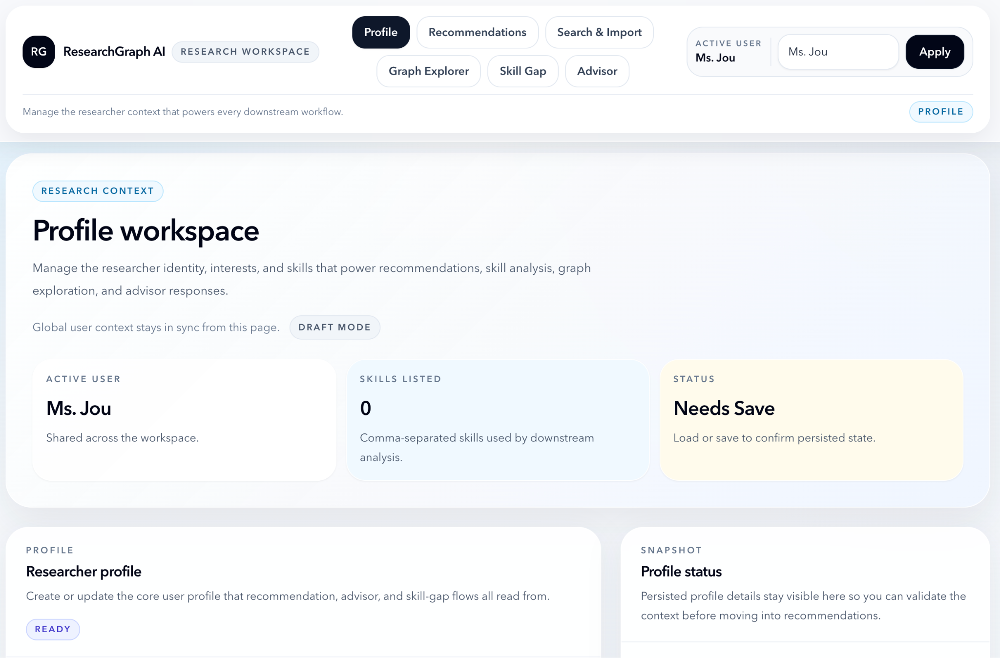
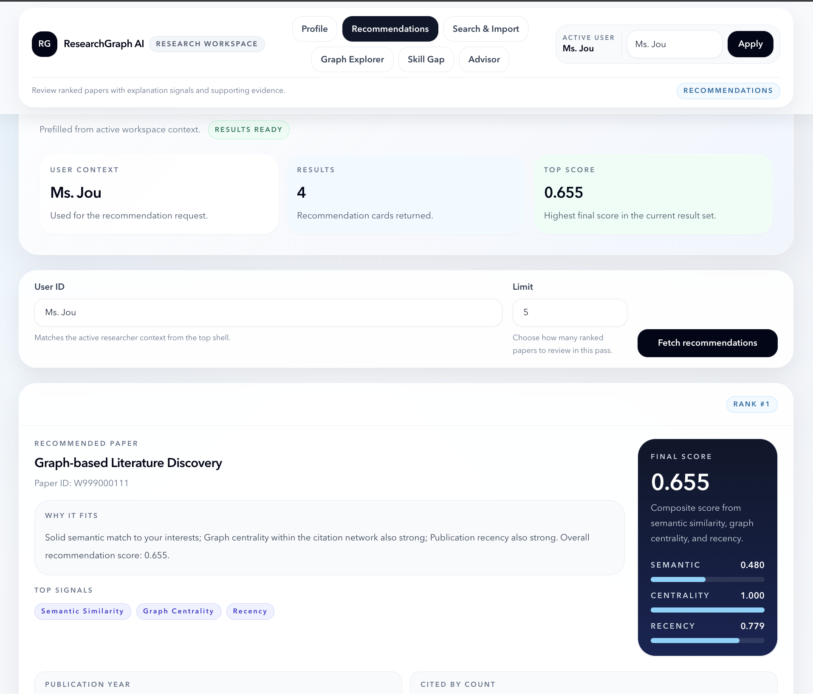
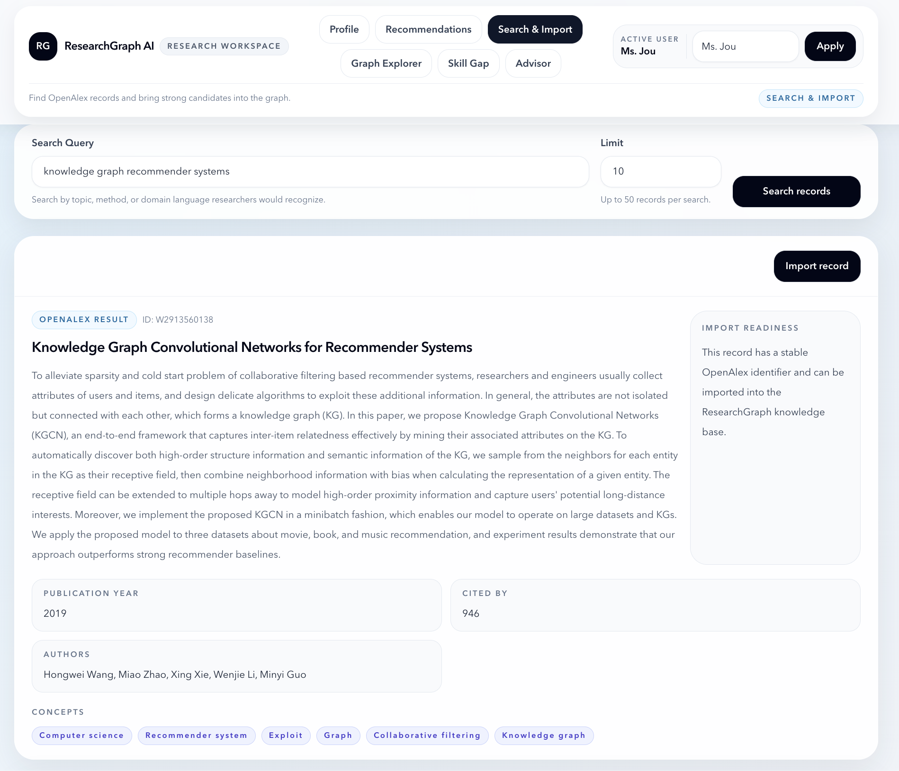
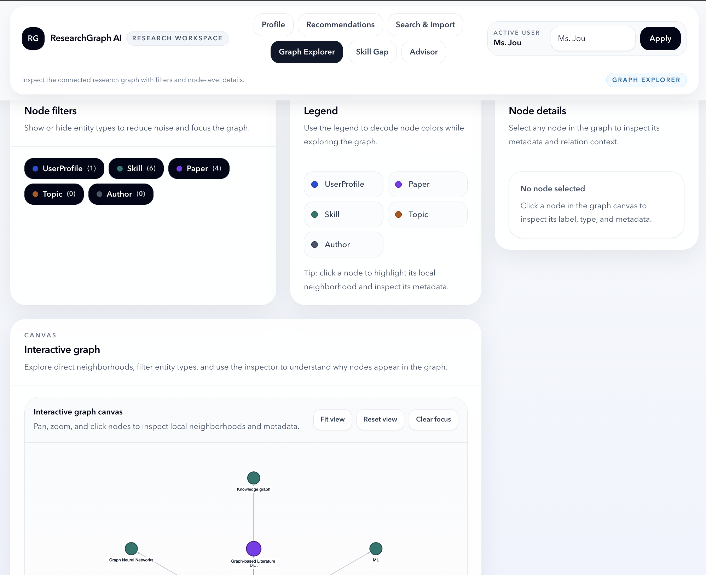
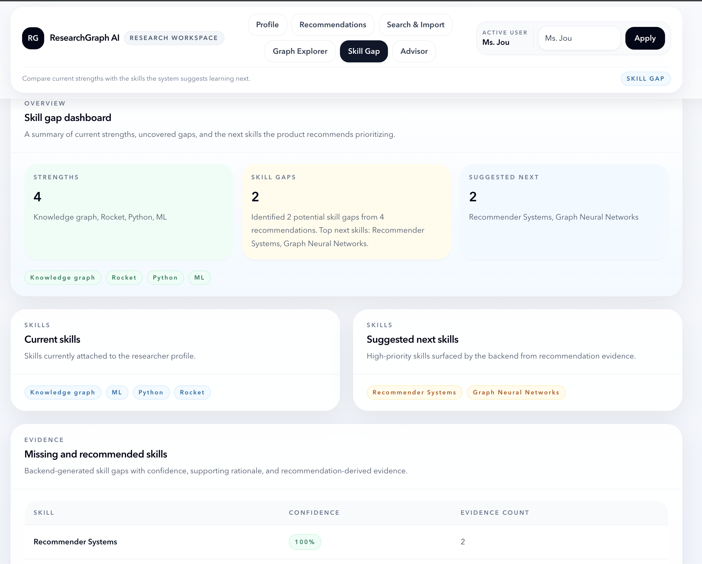
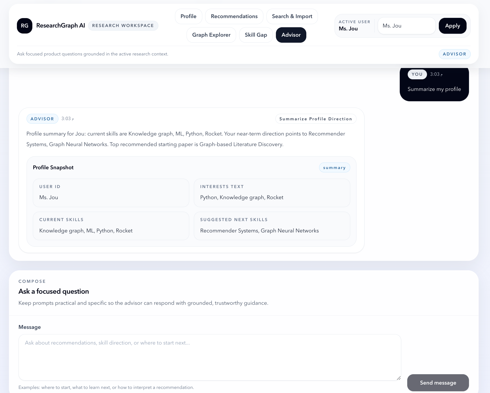

# ResearchGraph AI

**Explainable research discovery built as a graph-native SaaS-style workspace for paper search, recommendations, skill mapping, and advisor-guided exploration.**


## Tagline

ResearchGraph AI is a full-stack platform for research discovery and guidance. It combines OpenAlex ingestion, Neo4j graph storage, embedding-based ranking, explainable scoring, skill-gap analysis, and a modern React workspace for interacting with the system.

## Visual Overview



*Profile workspace with shared researcher context across the full product flow.*

## What The Project Does

ResearchGraph AI helps a researcher move through one connected workflow:

1. Create or load a researcher profile.
2. Search OpenAlex and import relevant papers into the knowledge graph.
3. Generate explainable recommendations using semantic, centrality, and recency signals.
4. Surface strengths, missing skills, and suggested next skills.
5. Ask an advisor for grounded, deterministic guidance.
6. Inspect papers, skills, topics, and authors in an interactive graph explorer.

## Why It Matters

Research workflows are often fragmented: search, recommendations, context tracking, and learning priorities live in separate tools. ResearchGraph AI brings those pieces together into one explainable product workflow, which makes it useful both as:

- an academic demo for ontology-guided, graph-aware recommender systems
- a portfolio project that demonstrates full-stack product thinking
- a foundation for future research-assistant or knowledge-work tooling

## Key Features

| Area | Implemented capability |
| --- | --- |
| Profile | Create, update, and load researcher profiles with interests, skills, and stored interest embeddings |
| Search & Import | Search OpenAlex, normalize results, and import papers into Neo4j by OpenAlex ID |
| Recommendations | Retrieve semantic, scored, and fully explained paper recommendations |
| Explainability | Expose weighted signals, evidence fields, and deterministic explanation text |
| Skill Gap | Compute strengths, missing skills, suggested next skills, and supporting paper evidence |
| Advisor | Return deterministic advisor responses over current profile and recommendation context |
| Graph Explorer | Visualize `UserProfile`, `Skill`, `Paper`, `Topic`, and `Author` nodes with filters and details |

## Platform Screenshots / Product Tour

### Profile Workspace


*Create or load a researcher profile and keep the active user context consistent across the app.*

### Recommendations


*Review ranked papers with score breakdowns, explanation text, and supporting evidence.*

### Search & Import


*Search OpenAlex, inspect normalized metadata, and import promising papers into the graph.*

### Graph Explorer


*Explore the connected research graph with filters, legend support, and node-level inspection.*

### Skill Gap Analysis


*Surface strengths, missing skills, next-skill priorities, and evidence-backed rationale.*

### Advisor


*Ask focused questions about the current research context through a deterministic advisor workflow.*

## System Architecture

```text
React + TypeScript + Tailwind frontend
        |
        v
FastAPI API layer (/api/v1)
        |
        +--> OpenAlex ingestion and normalization
        +--> Recommendation + explainability services
        +--> Skill-gap and advisor services
        +--> Graph composition for frontend exploration
        |
        v
Neo4j operational knowledge graph
        |
        v
Ontology layer (OWLReady2 + RDFLib)
```

## Tech Stack

| Layer | Technologies |
| --- | --- |
| Frontend | React 18, TypeScript, Vite, Tailwind CSS, Cytoscape.js |
| Backend | FastAPI, Uvicorn, Pydantic, Pydantic Settings |
| Graph / Data | Neo4j, OpenAlex |
| AI / Ranking | sentence-transformers |
| Ontology / Semantics | RDFLib, OWLReady2 |
| NLP / Extraction scaffolding | spaCy, KeyBERT |

## Backend Capabilities

The backend exposes a router-based FastAPI service under `/api/v1` with:

- health and Neo4j connectivity checks
- researcher profile create/read/update flow
- OpenAlex paper search
- direct single-paper and batch OpenAlex import
- semantic recommendations
- multi-signal scored recommendations
- fully explained recommendations
- deterministic skill-gap analysis
- deterministic advisor chat

It also manages:

- Neo4j connection lifecycle at application startup/shutdown
- environment-driven configuration
- OpenAlex timeout and error handling
- embedding generation using `sentence-transformers/all-MiniLM-L6-v2`
- centrality fallback to normalized `cited_by_count` when citation edges are sparse

## Frontend Capabilities

The frontend is a modular React workspace with:

- shared active user context in the top app shell
- lazy-loaded feature pages for heavier views
- reusable UI components for headers, cards, forms, metadata, and states
- clear loading, empty, error, and success patterns
- SaaS-style product shell across:
  - Profile
  - Recommendations
  - Search & Import
  - Skill Gap
  - Advisor
  - Graph Explorer

## Recommendation Pipeline

1. A researcher profile stores `interests_text` and a profile embedding.
2. Imported papers store embeddings generated from title + abstract content.
3. Candidate papers are ranked using three signals:
   - semantic similarity
   - graph centrality
   - recency
4. Final score is computed as a weighted combination:

```text
final_score = alpha * semantic + beta * centrality + gamma * recency
```

Current default weights:

| Weight | Value |
| --- | --- |
| `alpha` | `0.6` |
| `beta` | `0.25` |
| `gamma` | `0.15` |

The explainability layer then adds:

- `top_contributing_signals`
- `explanation_text`
- publication year and cited-by evidence
- embedding model and centrality source
- signal strength buckets for semantic, centrality, and recency

## Knowledge Graph And Ontology Role

ResearchGraph AI uses two complementary graph layers:

| Layer | Role |
| --- | --- |
| Neo4j operational graph | Stores the entities and relations used by the live product workflows |
| Ontology layer | Defines the formal domain schema for research entities and relations |

The current graph model includes nodes such as:

- `UserProfile`
- `Skill`
- `Paper`
- `Topic`
- `Author`

And relationships that support:

- profile-to-skill mapping
- paper-to-author and paper-to-topic structure
- recommendation and exploration context

## Advisor Chat

`POST /api/v1/advisor/chat` provides deterministic advisor responses using system context already stored in the platform. It does **not** rely on an external LLM API.

Current supported intent families include:

- explain my recommendations
- what should I learn next
- which paper should I start with first
- summarize my profile and direction
- compare top recommendations

The response includes:

- `detected_intent`
- `answer`
- optional `supporting_items`

## Skill Gap Analysis

`GET /api/v1/skill-gap` builds a backend-owned skill-gap view from:

- current profile skills
- recommendation outputs
- evidence fields attached to recommended papers

Returned data includes:

- `current_skills`
- `missing_skills`
- `suggested_next_skills`
- `strengths`
- `gaps_summary`

Each missing skill can include confidence, rationale, and supporting recommendation papers.

## Graph Explorer

The Graph Explorer is a React + Cytoscape.js interface that visualizes backend-derived graph data.

Current capabilities:

- type-based filtering
- node legend
- click-to-focus neighborhood highlighting
- fade-out of unrelated nodes and edges
- fit view / reset view / clear focus controls
- node details panel with metadata

Important implementation note:

> The explorer currently composes graph data from existing backend flows (profile, recommendations, skill gap, and search) rather than using a dedicated graph API endpoint.

## Local Setup

### Prerequisites

- Python 3.11+
- Node.js 18+
- Neo4j Community running locally

### Clone The Repository

```bash
git clone https://github.com/MarwanMAlfalah/ResearchAI.git
cd ResearcherAI
```

## Backend Run Instructions

```bash
cd backend
python3 -m venv .venv
source .venv/bin/activate
pip install -r requirements.txt
cp .env.example .env
```

Update `.env` with your Neo4j credentials and any optional config overrides, then run:

```bash
python run.py
```

Or run directly with Uvicorn:

```bash
uvicorn app.main:app --reload --host 0.0.0.0 --port 8000
```

Backend base URL:

```text
http://localhost:8000
```

## Frontend Run Instructions

```bash
cd frontend
cp .env.example .env
npm install
npm run dev
```

Frontend app URL:

```text
http://localhost:5173
```

The frontend expects:

```text
VITE_API_BASE_URL=http://localhost:8000/api/v1
```

## Demo Workflow

1. Open the Profile page and create or load a user.
2. Add interests and skills, then save the profile.
3. Go to Search & Import and import one or more OpenAlex papers.
4. Open Recommendations and fetch explained recommendations for the same user.
5. Review Skill Gap to inspect strengths, missing skills, and suggested next skills.
6. Use Advisor for grounded follow-up questions.
7. Open Graph Explorer to inspect the connected entities visually.

## API Reference

Base prefix: `/api/v1`

| Method | Endpoint | Purpose |
| --- | --- | --- |
| `GET` | `/health` | Service health check |
| `GET` | `/health/neo4j` | Neo4j connectivity check |
| `GET` | `/search/papers` | Search papers via OpenAlex |
| `POST` | `/import/paper` | Import one normalized paper payload |
| `POST` | `/import/paper/{openalex_id}` | Import one paper directly from OpenAlex |
| `POST` | `/import/papers/by-id` | Batch import papers by OpenAlex ID |
| `POST` | `/user/profile` | Create or update a user profile |
| `GET` | `/user/profile/{id}` | Get one user profile |
| `GET` | `/recommend/papers/semantic` | Get semantic recommendations |
| `GET` | `/recommend/papers/scored` | Get weighted recommendations |
| `GET` | `/recommend/papers/explained` | Get explained recommendations |
| `GET` | `/skill-gap` | Get deterministic skill-gap analysis |
| `POST` | `/advisor/chat` | Get deterministic advisor guidance |

## Current Limitations

- Full `CITES` edge ingestion from OpenAlex references is not implemented yet.
- Graph centrality falls back to normalized `cited_by_count` when graph-native citation structure is sparse.
- Skill-gap inference is deterministic and evidence-driven, but still heuristic-based.
- Graph Explorer currently builds from multiple existing endpoints instead of a dedicated graph endpoint.
- Advanced extraction and entity-linking capabilities are scaffolded but not fully integrated end to end.
- Authentication and multi-tenant user isolation are not implemented.
- Automated test coverage is still limited.

## Future Improvements

- Add full citation-edge ingestion and graph-native centrality.
- Introduce a dedicated backend graph endpoint for explorer performance and consistency.
- Deepen the extraction pipeline for methods, datasets, skills, and stronger entity linking.
- Add richer model signals such as link prediction or graph embeddings.
- Expand automated tests and CI.
- Add authentication, user management, and deployment hardening.

---

ResearchGraph AI is a portfolio-ready research platform prototype that demonstrates graph-aware ranking, explainable recommendations, ontology-backed modeling, and modern full-stack product execution in one repository.
